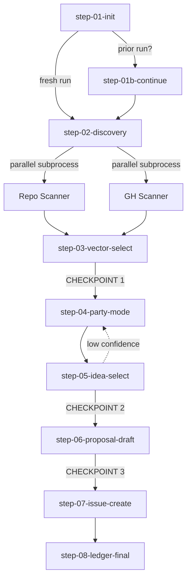

# Workflow Creation Plan

## Discovery Notes

**User's Vision:**
A project-specific, self-improving workflow that scans the repo (code, comments, README, architecture docs) and GitHub surface (PR comments, issues, discussions) to surface, ideate on, and formalize a single high-quality enhancement proposal as a GitHub issue. The workflow is opinionated about *abstraction-up*: rather than mechanical 1:1 CRUD-to-MCP-tool wrappers, it pushes ideators to think about how humans actually use the underlying system and design tool surfaces around real usage patterns (e.g. a Checklist higher-order tool instead of `set-checkbox` / `create-checkbox` primitives).

The workflow has a learning loop. It tracks the outcome of every proposal it generates so that future runs can correlate proposal characteristics with shipped outcomes, improving the quality of selection over time.

**Who It's For:**
- Primary: the repo maintainer (Jarad), invoked manually during iterative development
- Secondary (future): a scheduled nightly automation that drops fresh enhancement issues into the backlog
- Tertiary: any architect / dev team member who picks up a generated issue, the issue must be self-contained enough to act on with zero blocking questions

**What It Produces:**
- **Primary deliverable:** A single, high-quality GitHub enhancement issue, complete with rationale, scope, acceptance criteria, and references to the proposal artifact
- **Secondary deliverables:**
  - A proposal markdown artifact in the repo (the long-form thinking that backs the issue)
  - An entry in a tracked ledger (repo-local source of truth + GH labels for visibility)
  - On first run with no `_bmad-output/enhancement-forge/improvement-vectors.md`: a seeded vectors file based on quick repo analysis
- **Cumulative output (across runs):** A growing dataset that reveals which kinds of proposals actually ship, used to bias future selection

**Key Insights:**
1. **Hard separation between ideation and implementation.** The workflow's scope ends at the GH issue. No code changes, no PRs. This is intentional, conflating the two would dilute the quality of either.
2. **Multi-agent pipeline by design.** Sub-agents have single, narrow purposes:
   - Repo+GH Scanner (state assessment)
   - Vector Selector (chooses one improvement vector)
   - Party Mode facilitator (creative divergence across BMAD agents)
   - Idea Selector (convergence: picks one well-defined idea from Party Mode)
   - Proposal Writer (long-form proposal artifact)
   - PM (drafts and creates the GH issue)
3. **Optional `_bmad-output/enhancement-forge/improvement-vectors.md` as opinionated north star.** Defines named vectors (Feature Parity, UX/Ergonomics, Observability, Performance, Documentation, Security, Maintainability, etc.) that bias selection. If absent on first run, the workflow offers to bootstrap one from a quick repo analysis.
4. **Self-tracking ledger with two-axis success metric.**
   - `decision_to_implement: bool` (did the issue get accepted into a sprint / picked up?)
   - `implementation_success: bool` (did it actually ship?)
   - Both true = highest honor. Rich metadata (vector, category, complexity, surface area, agents involved, generation timestamp) attached for later correlation analysis.
5. **Tracking persistence: dual-write pattern.** Repo file (e.g. `_bmad-output/enhancement-forge/ledger.yaml`) is the source of truth, version controlled. GH labels mirror state for native visibility on issues.
6. **Triggering is decoupled from logic.** Manual slash command and nightly cron invoke the same workflow. The workflow itself does not care how it was started.
7. **Anti-pattern guardrail:** Proposals encouraging "expose new MCP endpoint that wraps Trello endpoint X 1:1" are explicitly de-prioritized in favor of higher-abstraction proposals that map to user intent.
8. **Recursive improvement-of-the-improver.** Because the ledger captures correlations, the workflow can eventually feed its own track record back into selection heuristics, creating a learning loop instead of a static pipeline.

## Classification Decisions

**Workflow Name:** `enhancement-forge`
**Target Path:** `/home/delorenj/code/mcp-server-trello/_bmad/custom/src/workflows/enhancement-forge/`

**4 Key Decisions:**
1. **Document Output:** `true` — produces proposal markdown, ledger entry, optional `_bmad-output/enhancement-forge/improvement-vectors.md`, and renders to GH issue body
2. **Module Affiliation:** `standalone` (custom) — project-aware to mcp-server-trello, lives in repo's custom location
3. **Session Type:** `continuable` — repo+GH scan and Party Mode can chew tokens, supports nightly cron and interrupted manual runs
4. **Lifecycle Support:** `tri-modal` — workflow itself will evolve as the ledger reveals patterns; Edit and Validate flows worth the upfront cost

**Structure Implications:**
- Folder structure: `workflow.md` + `data/` + `steps-c/` + `steps-e/` + `steps-v/`
- Includes `step-01b-continuation.md` for resumption logic
- Output frontmatter tracks `stepsCompleted` for resumption
- Tri-modal means three SELF-CONTAINED step trees (no shared step files); only `data/` is shared across modes
- Free-form template for primary output (proposal markdown)

## Requirements

**Flow Structure:**
- Pattern: Linear pipeline with two optional branches (bootstrap vectors when missing; loop on low-confidence idea selection)
- Phases: Bootstrap → Discovery (repo+GH scan) → Vector Selection → Party Mode Ideation → Idea Selection → Proposal Drafting → Issue Creation → Ledger Update
- Estimated steps: 7-8 step files in `steps-c/`, plus `step-01b-continuation.md`

**User Interaction:**
- Style: Mostly autonomous with strategic checkpoints
- Decision points: (1) approve selected vector, (2) approve selected idea, (3) approve proposal before GH issue creation
- Checkpoint frequency: 3 manual gates in interactive mode
- Cron mode behavior: checkpoints auto-approve when confidence threshold met, otherwise batched to a morning-review queue

**Inputs Required:**
- Required: git repo, `gh` CLI authenticated (or GH MCP), BMAD installed with Party Mode workflow available
- Optional: `_bmad-output/enhancement-forge/improvement-vectors.md` (auto-bootstrapped on first run from quick repo analysis), `_bmad-output/enhancement-forge/ledger.yaml` (created if missing)
- Prerequisites: prior issues fetched for dedup, repo readable, write access for ledger and proposal artifacts

**Output Specifications:**
- Type: document (multiple artifacts)
- Primary artifact: Proposal markdown (Structured format)
  - Required sections: Context, Problem, Proposed Solution, Higher-Order Abstraction Notes, Acceptance Criteria, Out-of-Scope, References, Tracking Metadata
- Secondary artifacts:
  - GH issue body (rendered from proposal, tracking metadata moved to labels)
  - Ledger entry (semi-structured YAML, one row per proposal)
  - Bootstrapped `_bmad-output/enhancement-forge/improvement-vectors.md` (free-form, only on first run when missing)
- Frequency: one proposal per run; ledger and vectors file accumulate across runs

**Success Criteria:**
- Per-run: GH issue created with all required sections, ledger entry persisted, no duplicate of recent proposals
- Quality bar: issue self-contained so an architect/dev can pick it up with zero blocking questions
- Quality gates:
  - Proposal references at least one piece of repo evidence (file path, PR, issue, commit)
  - Proposal includes higher-order abstraction reasoning (not 1:1 wrapper anti-pattern)
  - Acceptance criteria are testable
- Long-term: ledger correlation analysis shows selection quality improves over runs (decision_to_implement and implementation_success rates trend up)

**Instruction Style:**
- Overall: Mixed
- Prescriptive: scan steps, ledger writes, GH issue creation, label application (deterministic, schema-bound)
- Intent-based: Party Mode ideation, idea selection, proposal drafting, abstraction-up reasoning (creative, adaptive)
- Notes: prescriptive steps embed exact commands and schemas; intent-based steps embed principles and provocations


## Workflow Structure Preview

**Phase 1: Bootstrap & Continuation Check**
- Welcome and scope reminder (ideation, not implementation)
- Detect prior in-progress run via `stepsCompleted`; offer resume
- Check for `_bmad-output/enhancement-forge/improvement-vectors.md`; offer to seed if missing
- Verify `gh` CLI auth, repo state, ledger file existence

**Phase 2: Repo + GH Discovery**
- Sub-process A: scan repo (code, comments, docs, README, architecture.md)
- Sub-process B: scan GitHub (open issues, recent PRs and comments, discussions)
- Optional: web fetch (Trello API, MCP spec) for context delta
- Output: structured discovery report consumed by next phase

**Phase 3: Vector Selection**
- Vector Selector sub-agent reads vectors file + discovery report + ledger history
- Proposes one vector with reasoning, including dedup against recent ledger entries
- USER CHECKPOINT 1: approve vector, pick alternative, or regenerate

**Phase 4: Party Mode Ideation**
- Invoke `{partyModeWorkflow}` as sub-workflow with seeded prompt
- Constraint pinned: prefer abstraction-up over 1:1 wrappers
- Output: divergent idea set

**Phase 5: Idea Selection + Critique**
- Idea Selector sub-agent picks one idea with rationale
- Advanced Elicitation runs Socratic + counterfactual passes
- USER CHECKPOINT 2: approve, regenerate, or revisit Party Mode

**Phase 6: Proposal Drafting**
- Proposal Writer sub-agent renders structured proposal artifact
- Advanced Elicitation quality pass (gap, testability, evidence references)
- USER CHECKPOINT 3: approve, edit, or reject

**Phase 7: Issue Creation**
- PM sub-agent renders proposal into a `gh issue` body
- Applies labels (vector, complexity, surface-area)
- Returns issue URL

**Phase 8: Ledger Update + Completion**
- Append entry to `_bmad-output/enhancement-forge/ledger.yaml`
- Persist proposal artifact in `_bmad-output/enhancement-forge/proposals/`
- Print summary and next-run hints

## Tools Configuration

**Core BMAD Tools:**
- **Party Mode:** included — Integration: Phase 4 (Ideation), core to design
- **Advanced Elicitation:** included — Integration: Phase 5 (Socratic + counterfactual on selected idea) and Phase 6 (proposal quality gate)
- **Brainstorming:** excluded from primary path — Fallback only when Party Mode unavailable

**LLM Features:**
- **Web-Browsing:** included — Use case: vector-file seeding (Phase 1), optional Trello API / MCP spec deltas (Phase 2)
- **File I/O:** included — Operations: ledger writes, proposal artifact creation, vectors bootstrap, repo file reads
- **Sub-Agents:** included — Use case: five single-purpose sub-agents (Scanner, Vector Selector, Idea Selector, Proposal Writer, PM)
- **Sub-Processes:** included — Use case: Phase 2 parallelizes repo scan and GH scan

**Memory:**
- Type: continuable + sidecar-file
- Tracking: `stepsCompleted`, `lastStep` in run frontmatter
- Sidecar: `_bmad-output/enhancement-forge/ledger.yaml` is the cross-run memory enabling the learning loop

**External Integrations:**
- `gh` CLI (primary) for issue creation, label management, prior-issue fetch. Fallback: GitHub MCP if available
- `git` CLI (built-in) for repo scanning. No install
- Optional / future: vector-database (Qdrant) for semantic dedup against historical proposals. Flagged Phase 2, not MVP

**Installation Requirements:**
- `gh` CLI: verify on first run (almost certainly present in developer environment)
- BMAD: already installed
- No new installs for MVP
- User preference: minimize new dependencies; control-first stack

## Workflow Structure Design

### File Tree

Target: `/home/delorenj/code/mcp-server-trello/_bmad/custom/src/workflows/enhancement-forge/`

```
enhancement-forge/
├── workflow.md                              # Tri-modal entry (mode router)
├── data/                                    # SHARED across all modes
│   ├── default-improvement-vectors.md       # Vector seed template
│   ├── proposal-template.md                 # Structured proposal sections
│   ├── ledger-schema.yaml                   # Ledger entry schema + examples
│   ├── party-mode-seed.md                   # Party Mode prompt template
│   ├── label-conventions.md                 # GH label scheme
│   ├── anti-patterns.md                     # 1:1 wrapper anti-pattern + abstraction-up rules
│   └── sub-agents/                          # Single-purpose sub-agent definitions
│       ├── scanner.md
│       ├── vector-selector.md
│       ├── idea-selector.md
│       ├── proposal-writer.md
│       └── pm.md
├── steps-c/                                 # CREATE mode (run the pipeline)
│   ├── step-01-init.md
│   ├── step-01b-continue.md
│   ├── step-02-discovery.md
│   ├── step-03-vector-select.md
│   ├── step-04-party-mode.md
│   ├── step-05-idea-select.md
│   ├── step-06-proposal-draft.md
│   ├── step-07-issue-create.md
│   └── step-08-ledger-final.md
├── steps-e/                                 # EDIT mode
│   ├── step-e-01-load.md
│   ├── step-e-02-section-select.md
│   ├── step-e-03-edit.md
│   └── step-e-04-resync.md
└── steps-v/                                 # VALIDATE mode
    ├── step-v-01-target-select.md
    ├── step-v-02-quality-gates.md
    ├── step-v-03-ledger-audit.md
    └── step-v-04-report.md
```

### Run Output and Artifact Paths

| Artifact | Path |
|---|---|
| Run journal (stateful) | `_bmad-output/enhancement-forge/runs/{ts}-{slug}/run.md` |
| Proposal artifact | `_bmad-output/enhancement-forge/proposals/{ts}-{slug}.md` |
| Ledger | `_bmad-output/enhancement-forge/ledger.yaml` |
| Vectors file | `_bmad-output/enhancement-forge/improvement-vectors.md` (repo root) |

### Step Outline (steps-c/)

| # | Step | Type | Purpose | Sub-Agent | Subprocess Pattern |
|---|---|---|---|---|---|
| 1 | step-01-init | Init (continuable) | Continuation detection, vector bootstrap, env verification | none | none |
| 1b | step-01b-continue | Continuation | Resume from `stepsCompleted` | none | none |
| 2 | step-02-discovery | Middle (parallel subprocess) | Repo + GH scan; emit structured findings | Scanner (x2 parallel) | Pattern 4 + Pattern 1 |
| 3 | step-03-vector-select | Middle + checkpoint | Pick one vector, dedup against ledger; CHECKPOINT 1 | Vector Selector | Pattern 3 (ledger ops) |
| 4 | step-04-party-mode | Middle | Invoke Party Mode sub-workflow with seeded prompt | none (delegates to Party Mode) | none |
| 5 | step-05-idea-select | Middle + checkpoint | Pick idea, Adv Elicit critique; CHECKPOINT 2 | Idea Selector | none |
| 6 | step-06-proposal-draft | Middle + checkpoint | Render structured proposal, quality gate audit; CHECKPOINT 3 | Proposal Writer | Pattern 2 (gap audit) |
| 7 | step-07-issue-create | Middle (prescriptive) | Create GH issue via gh CLI, apply labels, return URL | PM | none |
| 8 | step-08-ledger-final | Final | Append ledger row, persist proposal, summary | none | none |

### Flow Diagram



### Sub-Agent Roster

Each is a single-purpose Agent invocation with a tight system prompt drawn from `data/sub-agents/*.md`.

| Agent | Single Purpose |
|---|---|
| Scanner | Produce structured discovery report from repo + GH state |
| Vector Selector | Pick exactly one vector with reasoning + dedup citation |
| Idea Selector | Choose one idea from Party Mode output, justify abstraction-up alignment |
| Proposal Writer | Render structured proposal artifact hitting all 8 required sections |
| PM | Render proposal into GH issue body, apply labels, create issue, return URL |

### Workflow Persona

**Enhancement Forge Steward.** Senior engineering strategist. Resists 1:1 wrappers, treats GH issue as a contract with downstream devs, maintains the learning ledger as a first-class artifact. Communication: peer-level, direct, concise, Mermaid for multi-agent flows.

### Validation and Error Handling

- **Per-step state:** every step appends to `stepsCompleted` in run-journal frontmatter; failures roll back the current step, never the run journal
- **Quality gates (step-06):** block CHECKPOINT 3 if any of {evidence ref, abstraction reasoning, testable AC} missing
- **Issue creation safety net:** `gh issue create --dry-run` first, present body, then real create
- **Ledger atomicity:** write-then-fsync, schema-validated against `ledger-schema.yaml`
- **Dedup floor:** if Vector Selector confidence below threshold, regenerate up to 2x, then escalate to user

### Special Features

- **Cron mode behavior:** read `confidence` and `dedup_distance` at each checkpoint; both above threshold → auto-approve and log to morning-review queue, otherwise halt and queue
- **Bootstrap branch (step-01):** missing `_bmad-output/enhancement-forge/improvement-vectors.md` triggers seed-from-scan, user reviews seeded vectors before continuing
- **Tri-modal mode router:** `workflow.md` reads invocation hint (`-v`, `-e`, default) to dispatch to `steps-c/`, `steps-e/`, or `steps-v/`

## Foundation Build Complete

**Created:**
- Folder structure at: `/home/delorenj/code/mcp-server-trello/_bmad/custom/src/workflows/enhancement-forge/`
  - `data/`, `data/sub-agents/`, `steps-c/`, `steps-e/`, `steps-v/`, `templates/`
- `workflow.md` (tri-modal mode router with create / edit / validate / cron dispatch)
- `templates/run-journal-template.md` (Free-form, frontmatter-rich, append-only run state)
- `templates/proposal-template.md` (Structured, 8 required sections + tracking metadata)
- `data/ledger-schema.yaml` (Semi-structured YAML schema with example entry)

**Configuration:**
- Workflow name: `enhancement-forge`
- Continuable: yes (with cron mode variant)
- Document output: yes (Structured proposal + Free-form run journal)
- Mode: tri-modal (create + edit + validate)

**Pending data/ files (to be created during step-build phases):**
- `data/default-improvement-vectors.md` (created in or used by step-01-init)
- `data/party-mode-seed.md` (used by step-04)
- `data/label-conventions.md` (used by step-07)
- `data/anti-patterns.md` (used by step-05, step-06)
- `data/sub-agents/scanner.md`, `vector-selector.md`, `idea-selector.md`, `proposal-writer.md`, `pm.md` (created alongside the steps that invoke them)

**Next Steps:**
- Step 8: Build step-01-init.md (and step-01b-continue.md)
- Step 9: Build remaining steps in steps-c/, steps-e/, steps-v/ (repeatable)

## All Steps Built

**Final inventory at `/home/delorenj/code/mcp-server-trello/_bmad/custom/src/workflows/enhancement-forge/`:**

- `workflow.md` (mode router)
- `templates/`: 2 files (run-journal-template, proposal-template)
- `data/`: 5 files (anti-patterns, default-improvement-vectors, label-conventions, ledger-schema, party-mode-seed)
- `data/sub-agents/`: 5 files (scanner, vector-selector, idea-selector, proposal-writer, pm)
- `steps-c/`: 9 files (step-01-init, step-01b-continue, step-02 through step-08)
- `steps-e/`: 4 files (step-e-01 through step-e-04)
- `steps-v/`: 4 files (step-v-01 through step-v-04)

**Total: 30 files.**

**Coverage of design intents:**
- Tri-modal mode router: ✅ workflow.md
- Continuation: ✅ step-01-init + step-01b-continue
- Subprocess optimization (Patterns 1, 2, 3, 4): ✅ documented in step-02, step-03, step-06
- 3 user checkpoints: ✅ step-03 (vector), step-05 (idea), step-06 (proposal)
- Cron-mode threshold gating: ✅ throughout
- 5 single-purpose sub-agents: ✅ data/sub-agents/
- Quality gates (5 original + 5 post-hoc): ✅ step-06 + step-v-02
- Ledger schema and atomic writes: ✅ data/ledger-schema.yaml + step-08 + step-e-04
- Anti-pattern guardrails: ✅ data/anti-patterns.md (loaded by Idea Selector + Proposal Writer + step-v-02)
- Workflow self-validation: ✅ step-v-04 inline workflow audit
