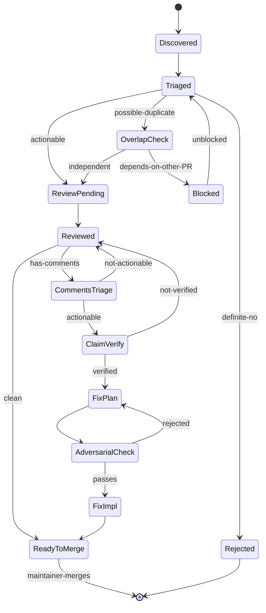
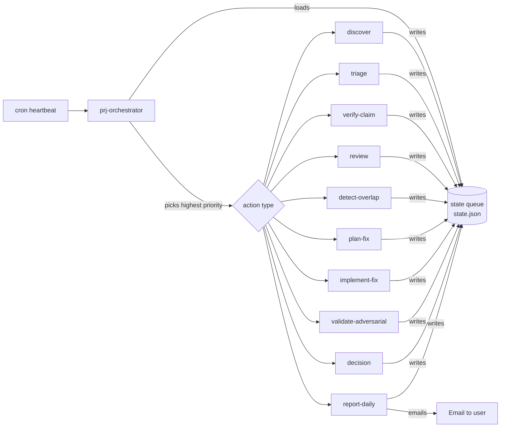

# Module Plan

## Vision

<!-- What this module does, who it's for, and why it matters -->

**Working brief (from user):** A cron-driven workflow that owns the lifecycle of a PR backlog with minimal human touchpoints. One cron cycle maps to one workflow phase. Capabilities include: triage (good vs. definite-no), code review, addressing reviewer comments, finding overlap and marking duplicates, labeling, daily reports, implementing fixes pointed out by comments, generating test plans, and adversarial validation against acceptance criteria. Goal: build trust in autonomous LLM operation by giving it a complete loop with clear hand-off points.

## Architecture

**Decision:** Multi-skill workflow module with state-machine coordination via persistent queue. No agent persona required at v1.

**Skill topology:** Multiple workflow skills, one orchestrator. The orchestrator is the only skill cron invokes directly. All other skills are invoked by the orchestrator based on the highest-priority action in the queue. No skill-to-skill direct calls; coordination always flows through state.

**Why workflow over agent:**

- Each phase action is discrete and procedural, no conversational continuity required.
- Headless cron-invocation maps cleanly to workflow execution semantics.
- Adversarial separation between Verifier/Validator and Implementer is naturally enforced by separate skill invocations with separate prompts and no shared context window. The skeptic cannot accidentally rationalize.
- Easy to test each phase in isolation (each skill is independently invocable).
- An agent persona could wrap output-producing skills later if a unified voice for PR comments and daily reports is desired, but the voice can also live as a tone-of-voice template inside those workflows.

**Per-PR state machine:**

**Heartbeat dispatch flow:**

### Memory Architecture

**Pattern:** No per-skill persistent memory. Shared state queue (data layer) plus per-PR cache and Hindsight long-term knowledge.

- **State queue** at `{project-root}/_bmad-output/pr-workflow/state.json`. Source of truth for "what happens next." Holds in-flight PRs, current phase per PR, next-action priority, blockers, last-run timestamps.
- **Per-PR cache** at `{project-root}/_bmad-output/pr-workflow/prs/{pr-number}/`. Review notes, verification results, fix proposals, decision log. Survives heartbeats so the agent can reference its own prior work.
- **Daily archive** at `{project-root}/_bmad-output/pr-workflow/reports/{YYYY-MM-DD}.md`. Frozen copy of each daily report.
- **Hindsight bank** named `prj` (or per-repo `mcp-server-trello-prj`). Long-term knowledge: project conventions learned, recurring fix patterns, user preferences, "do not do X" rules.
- **No per-skill personal memory.** Each skill loads state at start, writes at end, exits. Stateless invocation.

### Memory Contract

| File or bank | Purpose | Read by | Written by |
| --- | --- | --- | --- |
| `state.json` | Live queue + per-PR phase state | All skills | All skills |
| `prs/{n}/review.md` | Review notes for PR n | review, validate-adversarial, decision, report-daily | review |
| `prs/{n}/verification.md` | Claim verification results | plan-fix, validate-adversarial | verify-claim |
| `prs/{n}/fix-plan.md` | Proposed fix and failing test | implement-fix, validate-adversarial | plan-fix |
| `prs/{n}/decisions.log` | Append-only decision log | decision, report-daily | All decision-making skills |
| `reports/{date}.md` | Daily report archive | (humans, audit) | report-daily |
| Hindsight `prj` bank | Long-term knowledge | All skills | All skills (selective) |

### Cross-Agent Patterns

No agent-to-agent direct calls. All coordination flows through the state queue.

- **Cron** is the only invoker of the orchestrator.
- **Orchestrator** is the only invoker of phase skills.
- **Phase skills** read state, perform their action, write state, exit. They do not invoke each other.
- **Adversarial separation** is structural: `validate-adversarial` runs as a separate invocation with a separate prompt and no shared context with `plan-fix` or `implement-fix`.
- **Reporting** is purely read-only over the state and per-PR archives.

## Skills

**Skill list (proposed, pending user confirmation):**

| # | Skill | Type | Purpose |
| --- | --- | --- | --- |
| 1 | `prj-orchestrator` | workflow | Cron entry. Load queue, pick highest-priority action, dispatch. |
| 2 | `prj-discover` | workflow | Sync GitHub state into queue. Find new PRs and new comments. |
| 3 | `prj-triage-pr` | workflow | Classify PR: actionable / definite-no / possible-duplicate. Apply labels. |
| 4 | `prj-triage-comment` | workflow | Classify comment: actionable / advisory / noise. |
| 5 | `prj-verify-claim` | workflow | Reproduce alleged bug or push back with a question. |
| 6 | `prj-review` | workflow | Full code review of PR. Notes + confidence + recommendation. |
| 7 | `prj-detect-overlap` | workflow | Find PRs touching same files or concepts. Flag duplicates. |
| 8 | `prj-plan-fix` | workflow | Design fix for verified claim. Write failing test. |
| 9 | `prj-implement-fix` | workflow | Push fix branch, open PR into contributor branch. |
| 10 | `prj-validate-adversarial` | workflow | Adversarial check before any implementation. Gate. |
| 11 | `prj-decision` | workflow | Final PR call: ready-to-merge, request-changes, close-as-not-now. |
| 12 | `prj-report-daily` | workflow | Aggregate state and per-PR archives, send daily email. |

**Per-skill briefs to be drafted in Phase 5 after skill list confirmation.**

**Open consolidation forks for user:**

- Merge `prj-triage-pr` + `prj-triage-comment` into one `prj-triage` with mode parameter? Lean: merge.
- Fold `prj-discover` into `prj-orchestrator` as side-effect of every heartbeat, or keep separate? Lean: keep separate (different cost profile, runs on its own cadence).
- Merge `prj-plan-fix` + `prj-implement-fix`? Lean: keep separate, the split is where the adversarial gate runs.

## Configuration

Not ready, complete in Phase 3+

## External Dependencies

Not ready, complete in Phase 3+

## UI and Visualization

Not ready, complete in Phase 3+

## Setup Extensions

Not ready, complete in Phase 3+

## Integration

Not ready, complete in Phase 3+

## Creative Use Cases

Not ready, complete in Phase 3+

## Ideas Captured

### Initial Spark

- **Domain:** Open-source repo PR backlog (this repo: `mcp-server-trello`, currently 13 open PRs across features, bugfixes, refactors, and chore PRs).
- **Goal:** Maximize LLM autonomy across the full PR lifecycle. The user wants to ratchet trust in the LLM by handing it a complete loop, not a one-shot reviewer.
- **Operating model:** Cron-driven. One cron cycle = one workflow phase. Phases progress without continuous human prompting.
- **Capabilities the user listed:**
  - Triage: which PRs look good, which are definite-no
  - Code review
  - Address comments (read reviewer feedback, respond, act)
  - Detect overlap, mark duplicates, apply labels
  - Daily reports back to the user
  - Implement fixes that comments point out (write code, not just suggest)
  - Generate test plans
  - Validate against acceptance criteria from an adversarial viewpoint

### Observations from Repo State (2026-05-09)

- 13 open PRs. Likely overlap pair: PR #82 (refactor attachments domain) vs PR #81 (generic attach_data_to_card). Both touch attachments, one restructures, one adds a new tool. Either they merge cleanly in sequence or they are in conflict.
- PRs are heterogeneous: features (custom fields, name filter, copy_card, intelligent caching), bug fixes (truncate descriptions), workspace config (TRELLO_ALLOWED_WORKSPACES), README patches, and one WIP draft (bun version-bump script).
- Heterogeneity matters: triage rules cannot be uniform. A README typo PR has different acceptance bar than a caching layer PR.

### Open Threads to Explore

- Is Trello the workflow's state machine? Each PR becomes a card; lists represent phases (Triage, Review, Comment-Address, Implement, Test, Decision). Dogfood angle: this module would *use* the trello MCP server it lives in.
- Cron rhythm: one cycle advances all in-flight cards by one phase, or one cycle = one whole-board sweep through one phase?
- "Implement fixes" autonomy levels: propose a diff in a comment, push to a fix branch, push directly to the PR's branch (with author permissions), or open a follow-up PR?
- Trust ramp: graduated autonomy. Starts in "propose only" mode, ratchets up as the user approves more.
- Daily report channel: Trello card, markdown file in the repo, hindsight memory write, email, none-of-the-above.
- Adversarial test plan generator: should it actively try to break the change, propose breaking inputs, hunt for unhandled edge cases?

### Phase 1 Round 1: User Answers and Recommendations

**Locked:**

- **(Q1) Domain-agnostic.** Module operates on any repo's PR backlog. The mcp-server-trello repo is just the initial test rig. No coupling to Trello.
- **(Q4) Email v1** to `jaradd@gmail.com`. Spec a `Reporter` interface so Telegram, Slack, and other channels become drop-in implementations later.

**Tentative (pending user confirmation):**

- **(Q2) Cron rhythm.** Fixed-interval heartbeat (every 10-15 min) reading a persistent state queue at `_bmad-output/pr-workflow/state.json`. Each heartbeat loads the queue, executes one state transition for the highest-priority PR, updates the queue, exits. The agent expresses urgency through queue priority, not by writing new cron entries. Rationale: avoids the stall-failure mode of agent-driven scheduling, aligns with event-driven architecture (cron = timer, queue = bus). Confirms user instinct of "1 run = 1 transition" while replacing chained-cron mechanism with a heartbeat+queue.
- **(Q3) Fix implementation v1.** Agent pushes to a unique branch on this repo and opens a PR INTO the contributor's branch. Reversible (PR not force-push), transparent (all actions in GitHub UI), consent-respecting (author retains branch autonomy), audit-clean (commits signed under bot identity). Future trust ladder: direct push when "Allow edits from maintainers" is enabled, then maintainer-owned `fix/auto-{n}` branches for triage-confirmed definite-yes PRs.

**Pre-launch communication:** Sticky issue or README banner announcing the automated PR Jangler bot. Establishes consent before surprise.

### Phase 1 Round 2: Worst-Case Failure Mode and Guard Rails

**The worst case (from user):** A commenter calls out a request or bug that is not actually a bug, or whose suggested fix is wrong. The agent acts on the comment, breaking working code or changing behavior in undesired ways.

This is THE central design constraint, not an edge case. Treating comments as authoritative is exactly how a confident agent breaks correct code. It directly shapes the architecture.

**Guard rails the worst case requires:**

1. **Claim verification before action.** Any comment demanding a change must pass a reproduction step. Agent must reproduce the failure before treating it as a bug. If reproduction fails, agent posts: "I tried to reproduce this, here is what I saw, can you clarify?" and does not implement.

2. **Source-of-truth hierarchy.** Comments rank below the contract. Order:
   1. PR description and stated acceptance criteria (the contract)
   2. Project conventions and existing test suite (the ground)
   3. Maintainer comments (highest-weighted human voice)
   4. Other contributor comments (advisory only)
   5. Linked issues (context)

   Conflicts between layers raise a flag, never trigger an implementation.

3. **Failing-test-first gate.** Before any fix-PR opens, the agent writes a failing test that demonstrates the bug, then the fix, then proves the test passes and no other tests regress. Cannot write a failing test? Bug is not well-defined, fix does not ship.

4. **Confidence threshold.** Each proposed change gets a confidence score combining: did the test reproduce, is the comment from maintainer or random contributor, is core or edge code touched. Below threshold = comment with proposal only. Above = fix-PR. Starts very high, ratchets up only on track record.

5. **Adversarial validation as a phase, not a final check.** Between triage and implementation, a verification phase challenges the premise: "Is this actually a bug? Would NOT applying this break anything? Is there a simpler explanation we are missing?" Only verified claims advance to implementation. This connects the user's earlier "adversarial view" capability directly to the worst-case guard rail.

6. **Ambiguity escape hatch.** Agent has a "please advise" output. Posts on the PR, surfaces in the daily report, blocks implementation until clarified.

**Phase rename implied by guard rails:** "Address Comments" splits into **Triage Comments** (classify actionable / advisory / noise) plus **Verify Claim** (reproduce or push back). Implementation only fires when both pass with high confidence.

## Build Roadmap

Not ready, complete in Phase 3+

**Next steps:**

1. Build each skill using **Build an Agent (BA)** or **Build a Workflow (BW)**, share this plan document as context
2. When all skills are built, return to **Create Module (CM)** to scaffold the module infrastructure
